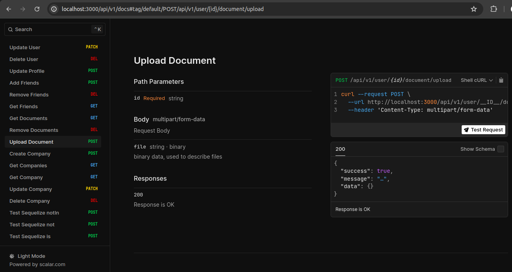

## Demo repository for [sequelize-to-openapi](https://github.com/techntools/sequelize-to-openapi)

```base
npm i
npm run dev
```

## Run Locally

* Install nodemon
* Copy the .env.example to .env and change values as per your setup
* Create the database with `create database seqop`
* Use `DB_SYNC=1 npm run dev` to create tables in database

And then visit the documentation at http://localhost:3000/api/v1/docs


